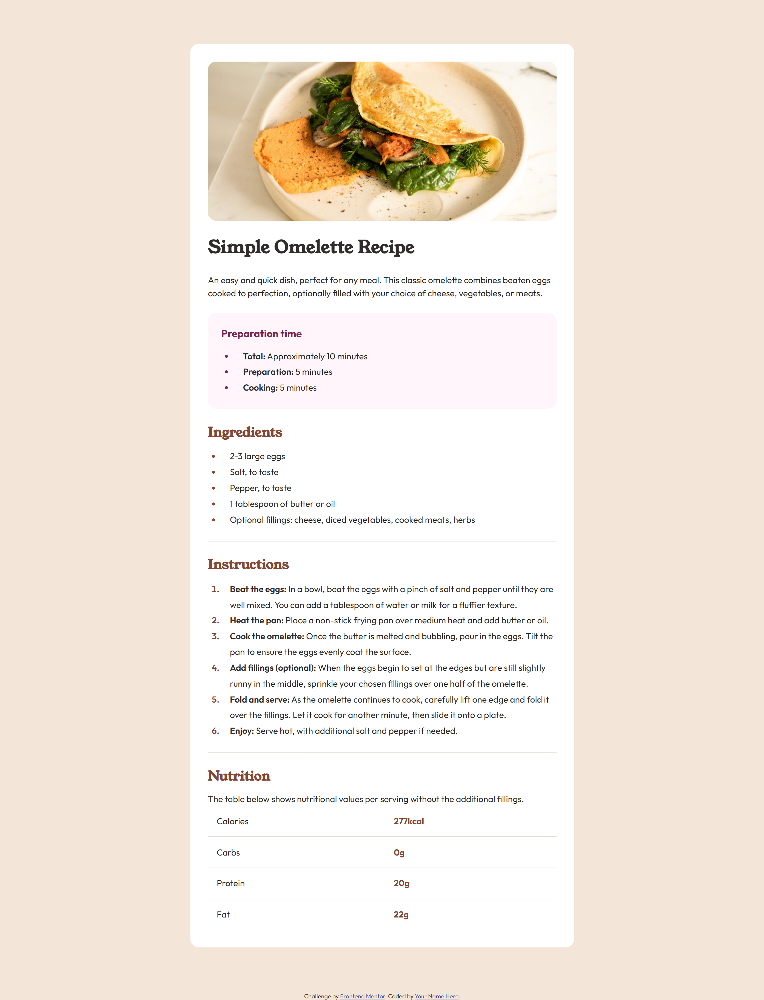

# Frontend Mentor - Recipe Page

## Descripción
Proyecto de Recipe Page de Frontend Mentor. Consiste en recrear el diseño de una página de receta simple, utilizando HTML y CSS. 

## Captura

## Tecnologías utilizadas
- HTML
- CSS

## Autor
- GitHub: https://github.com/agustinmachadodev